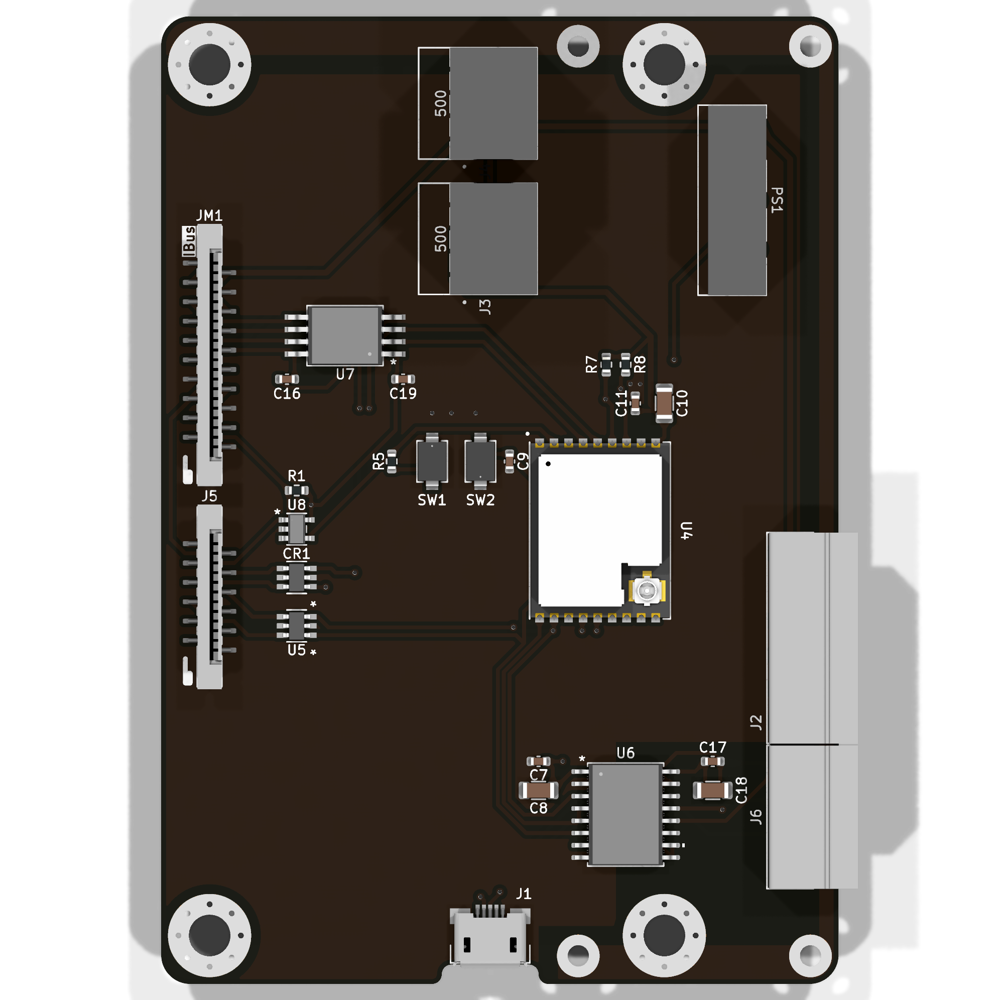
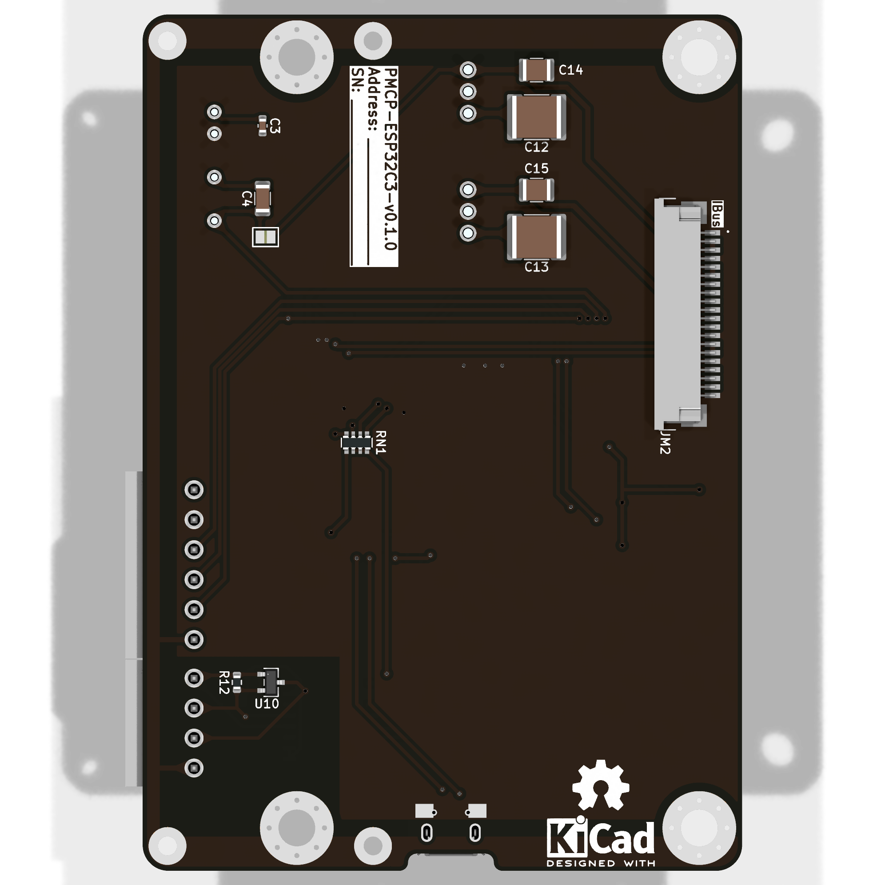

import Options  from '@components/Options.astro';

import { options_config } from './PMCP-ESP32C3/options.ts';

{frontmatter.description} [^1].

## Конфигурация

<Options options_config = {options_config} />

## Внешний вид

## Описание

[^1]: **ESP32-C3** - https://www.espressif.com/en/products/socs/esp32-c3
