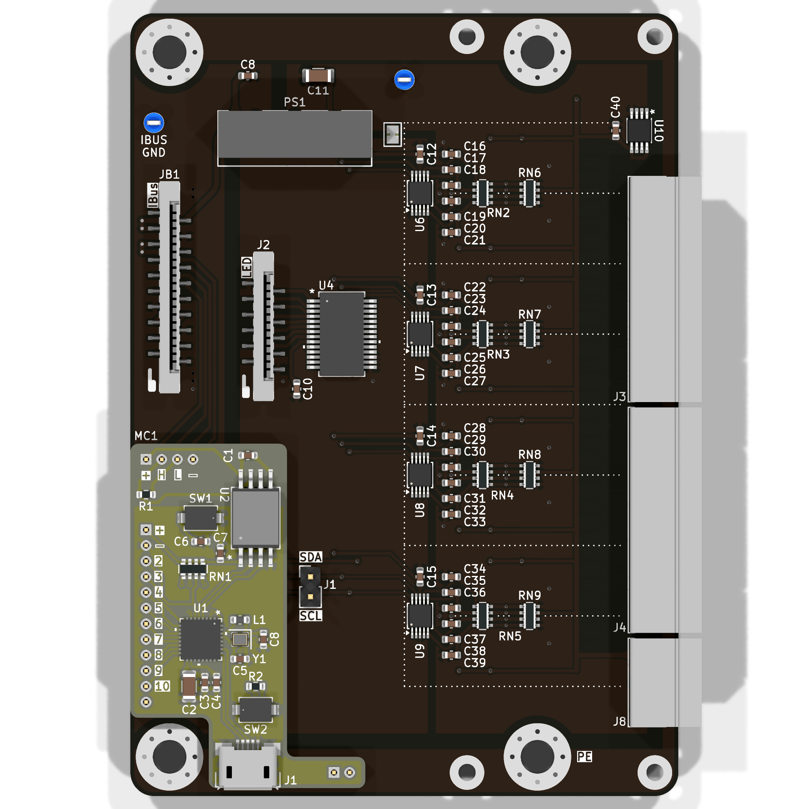
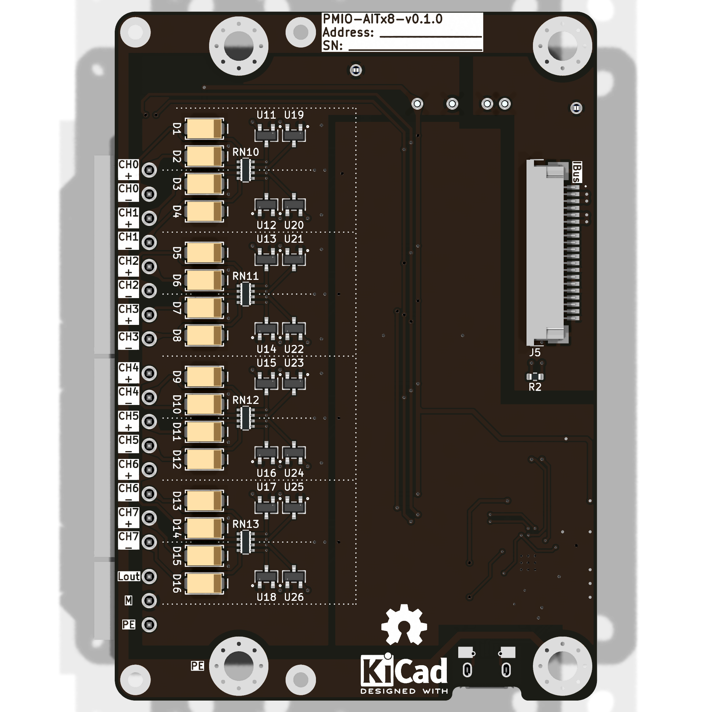

import { Icon } from '@astrojs/starlight/components';
import Options  from '@components/Options.astro';

import ExtConn from "./PMIO-AITx8/ext_conn.svg";
import Schematic from "./PMIO-AITx8/schematic.svg";
import { options_config } from './PMIO-AITx8/options.ts';

    { frontmatter.description }

## Схема внешних подключений

<ExtConn/>

К модулю не нужно подключать внешнее питание. Через клеммник XD02 выводится питание 3.3В от внутреннего источника.

## Конфигурация

<Options options_config = {options_config} />

## Внешний вид

## Описание

<Schematic />

В качестве АЦП используется микросхема **ADS1115**. Используется дифференциальное подключение, к одному чипу ADS1115 можно подключить 2 канала измерения термопар.

**ADS1115** управляются по шине I²C. Адреса чипов - `0x48`, `0x49`, `0x4A` и `0x4B`.

На плате есть разъём для подключения модуля светодиодов [PMLD-10](/modules/pmld/pmld-10). Для управления состоянием светодиодов используется GPIO-расширитель **MCP23017**. Адрес на шине I²C - `0x20`.

Для компенсации температуры холодного спая на плате установлен датчик температуры **TMP75**. Адрес датчика на шине I²C - `0x4C`.

Для управления всеми чипами используется микроконтроллер **ESP32-C3**. Микроконтроллер:

- опрашивает АЦП **ADS1115** по шине I²C
- опрашивает датчик температуры холодного спая
- определяет по таблицам из стандарта МЭК 60584 значение температур по каналам
- устанавливает состояние светодиодов на модуле PMLD-10
- отправляет данные измерений температур на CAN-шину

Распиновка микроконтроллера **ESP32-C3**:

- I²C:
  - SDA - GPIO 8
  - SCL - GPIO 2
- CAN:
  - RX - GPIO 10
  - TX - GPIO 7

**ESP32-C3** передаёт данные на CAN-шину через CAN-трансивер **CA-IS3050**.

## Ссылки

|  |  |  |
| --- | --- | --- |
| **ADS1115** даташит | [Скачать](/datasheets/ads1115.pdf) | [Ссылка](https://www.ti.com/product/ADS1115) |
| **CA-IS3050** даташит | [Скачать](/datasheets/CA-IS3050.pdf) | [Ссылка](https://e.chipanalog.com/products/interface/isolated/ict/722) |
| **ESP32-C3** даташит | [Скачать](/datasheets/ESP32-C3.pdf) | [Ссылка](https://www.espressif.com/en/products/socs/esp32-c3) |
| **MCP23017** даташит | [Скачать](/datasheets/MCP23017.pdf) | [Ссылка](https://www.microchip.com/en-us/product/mcp23017) |
| **TMP75** даташит | [Скачать](/datasheets/tmp75.pdf) | [Ссылка](https://www.ti.com/product/TMP75) |
| A Basic Guide to Thermocouple Measurements. SBAA274A, Texas Instruments | [Скачать](/datasheets/SBAA274A.pdf) | [Ссылка](https://www.ti.com/lit/an/sbaa274a/sbaa274a.pdf) |
| Thermocouple Cold Junction Compensation. Renesas | [Скачать](/datasheets/SLG47011.pdf) | [Ссылка](https://www.renesas.com/en/document/apn/cm-389-thermocouple-cold-junction-compensation) |
