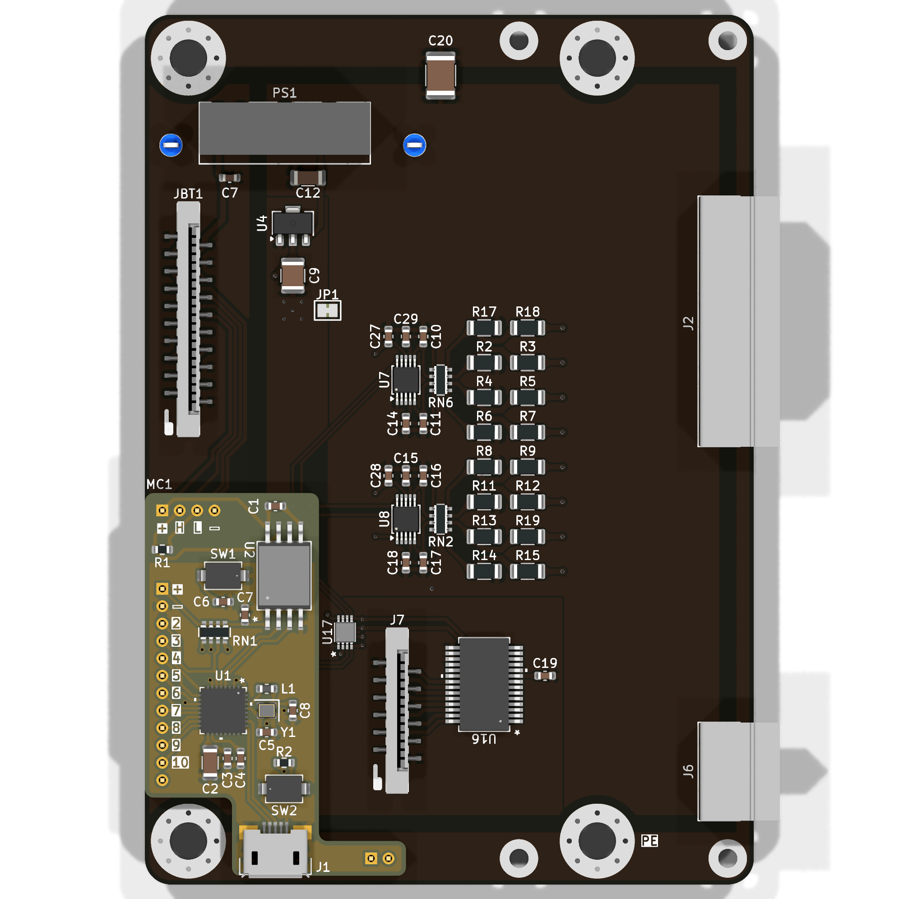
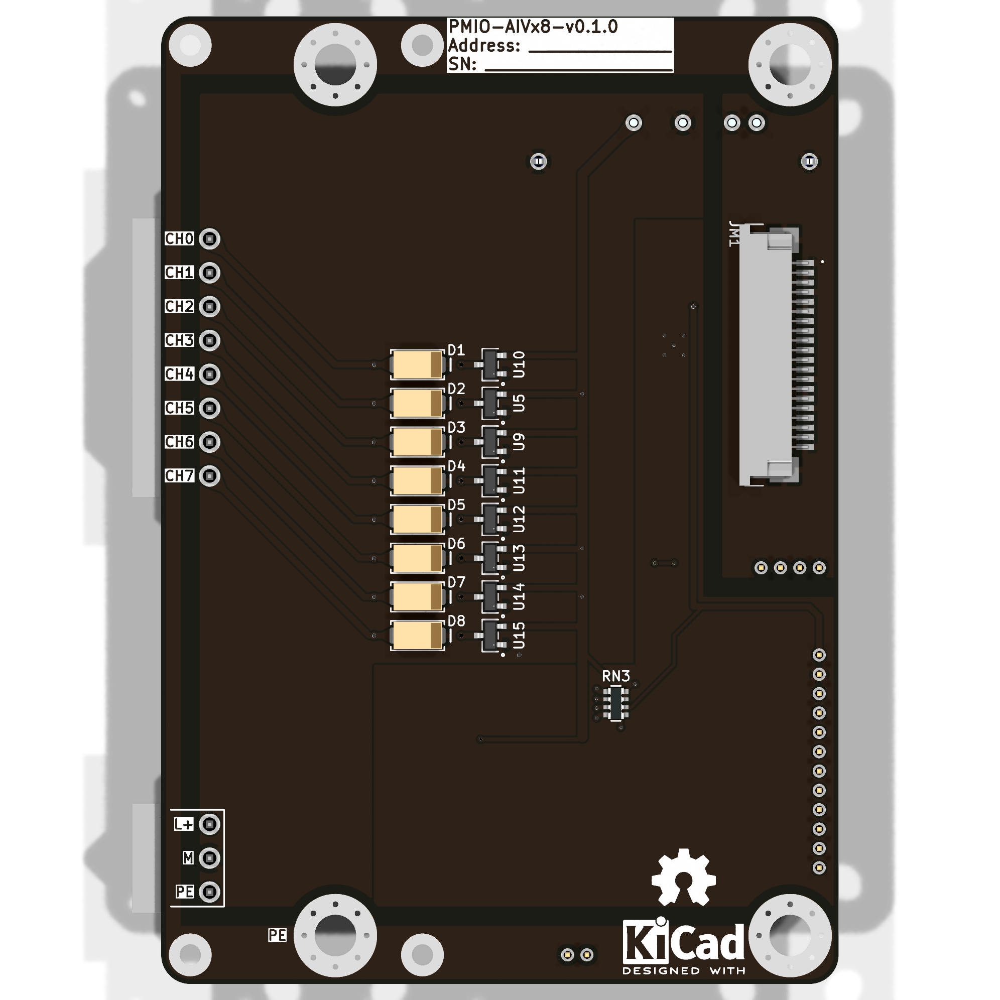

import Options  from '@components/Options.astro';
import ExtConn from "./PMIO-AITx8/ext_conn.svg";
import Schematic from "./PMIO-AITx8/schematic.svg";
import { options_config } from './PMIO-AIVx8/options.ts';

import VoltageChannel from "./PMIO-AIVx8/kicad_images-pmio_aiv_voltage_channel.svg";
import CurrentChannel from "./PMIO-AIVx8/kicad_images-pmio_aiv_current_channel.svg";

    { frontmatter.description }

## Конфигурация

<Options options_config = {options_config} />

## Внешний вид

## Описание

### Схема канала 0-10 В

<VoltageChannel width={700} height={280}  preserveAspectRatio="xMidYMax meet"/>

На рисунке отображена схема измерения сигнала 0-10 В.

**SMAJ33CA** - защитный TVS-диод. Нужен для защиты от кратковременных выбросов напряжения.

Резисторы **R602** и **R603** образуют делитель напряжения. С помощью АЦП **ADS1115** можно измерить напряжение, не превышающее напряжение питания. В данной схеме для питания АЦП используется напряжение 5 В. С помощью делителя входное напряжение 10 В ограничивается до 4 В:

$ I = \frac{V_{input}}{R_{602} + R_{603}} = \frac{V}{R_{602}} $

$ V = \frac{V_{input} \cdot R_{602}}{R_{602} + R_{603}} = \frac{10 В \cdot 220 Ом } {220 Ом + 330 Ом} = 4В $

Для измерения входного сигнала 4 В можно использовать диапазон измерения АЦП ±4,096 В (FSR). Разрядность АЦП 16 бит. При этом один шаг соответствует $\frac{FSR}{2^N} = \frac{2 \cdot 4.096 В}{2^{16}} = 125 мкВ$. Для диапазона измеряемого сигнала 4 В это даёт $\frac{4 В}{125 мкВ} = 32000$ фактических шагов. Получается примерно 15 бит теоретического разрешения.

**BAV199** - сборка из двух диодов. Необходима для ограничения входного сигнала АЦП в диапазоне GND..5V. При выходе напряжения за диапазон один из диодов открывается.

Резистор **R601** и конденсатор **C601** образуют фильтр нижних частот. Частота среза 482 Гц:

$ f = \frac{1}{2 \pi \cdot R_{601} \cdot C_{601}} = \frac{1}{2 \pi \cdot 330 Ом \cdot 10^{-6} Ф} = 482 Гц $

### Схема канала 4-20 мА

<CurrentChannel width={700} height={280}  preserveAspectRatio="xMidYMax meet"/>

На рисунке отображена схема измерения сигнала 0-20 мА.

**SMAJ33CA** - защитный TVS-диод. Нужен для защиты от кратковременных выбросов напряжения.

Самовосстанавливающийся предохранитель **nSMD005** срабатывает при перегрузке по току.

Резистор **R702** используется как шунт для измерения тока. При 20 мА на падение напряжения на резисторе составит 2 В:

$ V = I \cdot R_{702} = 0,020 А \cdot 100 Ом = 2 В $

Для измерения входного сигнала 2 В можно использовать диапазон измерения АЦП ±2,048 В (FSR). Разрядность АЦП 16 бит. При этом один шаг соответствует $\frac{FSR}{2^N} = \frac{2 \cdot 2.048 В}{2^{16}} = 62,5 мкВ$. Для диапазона измеряемого сигнала 2 В это даёт $\frac{2 В}{62.5 мкВ} = 32000$ фактических шагов. Получается примерно 15 бит теоретического разрешения.

**BAV199** - сборка из двух диодов. Необходима для ограничения входного сигнала АЦП в диапазоне GND..5V. При выходе напряжения за диапазон один из диодов открывается.

Резистор **R701** и конденсатор **C701** образуют фильтр нижних частот. Частота среза 482 Гц:

$ f = \frac{1}{2 \pi \cdot R_{601} \cdot C_{601}} = \frac{1}{2 \pi \cdot 330 Ом \cdot 10^{-6} Ф} = 482 Гц $

## Ссылки

|  |  |  |
| --- | --- | --- |
| **ADS1115** даташит | [Скачать](/datasheets/ads1115.pdf) | [Ссылка](https://www.ti.com/product/ADS1115) |
| **CA-IS3050** даташит | [Скачать](/datasheets/CA-IS3050.pdf) | [Ссылка](https://e.chipanalog.com/products/interface/isolated/ict/722) |
| **ESP32-C3** даташит | [Скачать](/datasheets/ESP32-C3.pdf) | [Ссылка](https://www.espressif.com/en/products/socs/esp32-c3) |
| **MCP23017** даташит | [Скачать](/datasheets/MCP23017.pdf) | [Ссылка](https://www.microchip.com/en-us/product/mcp23017) |
