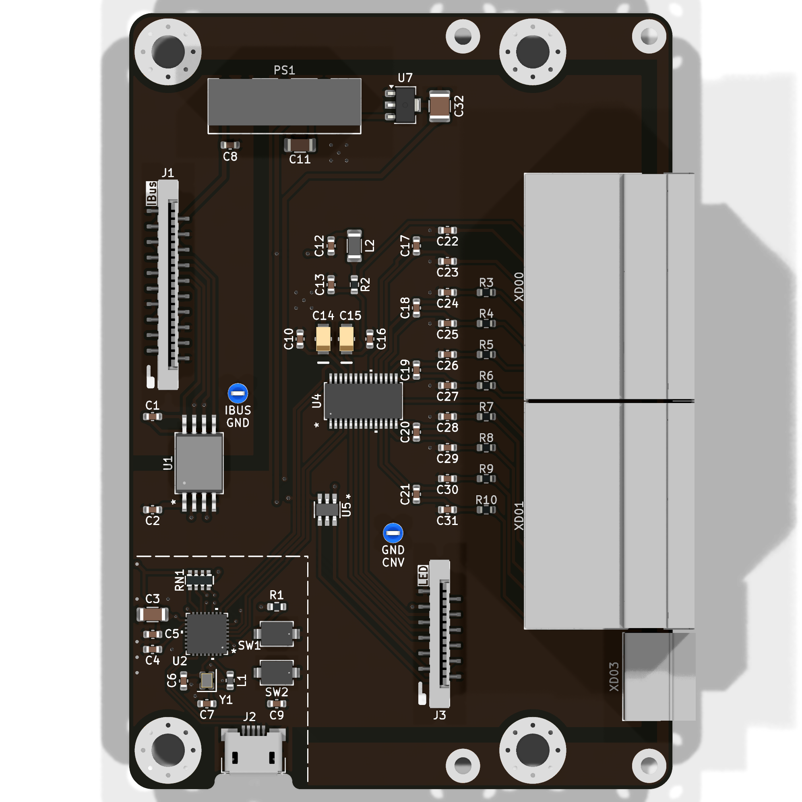
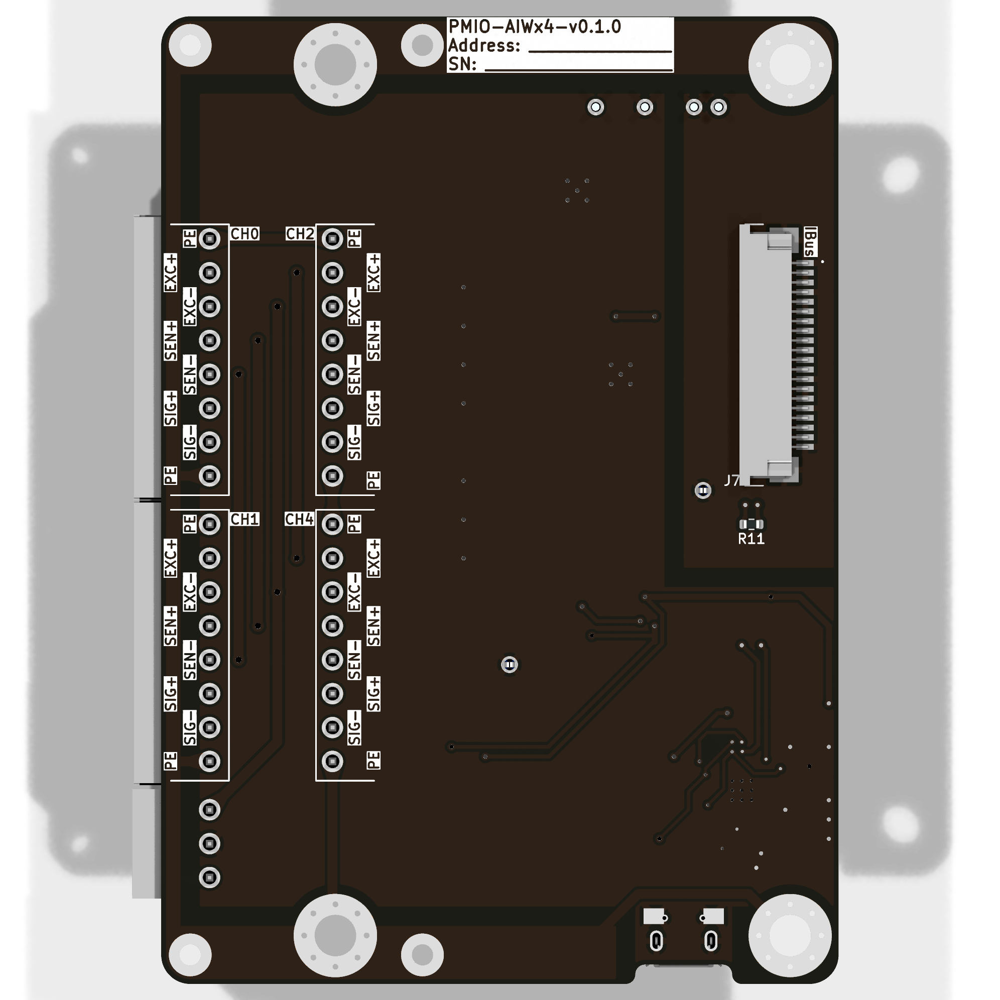

import Options  from '@components/Options.astro';
import ExtConn from "./PMIO-AIWx4/ext_conn.svg";
import Schematic from "./PMIO-AIWx4/schematic.svg";
import { options_config } from './PMIO-AIWx4/options.ts';

    { frontmatter.description }

Используется АЦП **AD7193** [^1]. Датчики подключаются на независимые каналы АЦП.

## Схема внешних подключений

<ExtConn />

При подключении 4-проводных тензодатчиков необходимо поставить перемычки EXC+, SEN+ и EXC-, SEN-.

## Конфигурация

<Options options_config = {options_config} />

## Внешний вид

## Описание

<Schematic />

На плате установлен микроконтроллер **ESP32-C3** [^2], который опрашивает АЦП по интерфейсу SPI и отправляет данные во внутреннюю шину IBus через CAN-шину.

Распиновка микроконтроллера **ESP32-C3**:

- SPI
  - MOSI - GPIO 3
  - MISO - GPIO 4
  - SCK - GPIO 1
  - CS - GPIO 0
- CAN:
    - RX - GPIO 1
    - TX - GPIO 0

**ESP32-C3** передаёт данные на CAN-шину через CAN-трансивер **CA-IS3050** [^3].

[^1]: **AD7193** - https://www.analog.com/en/products/ad7193.html

[^2]: **ESP32-C3** - https://www.espressif.com/en/products/socs/esp32-c3

[^3]: **CA-IS3050** - https://e.chipanalog.com/products/interface/isolated/ic
