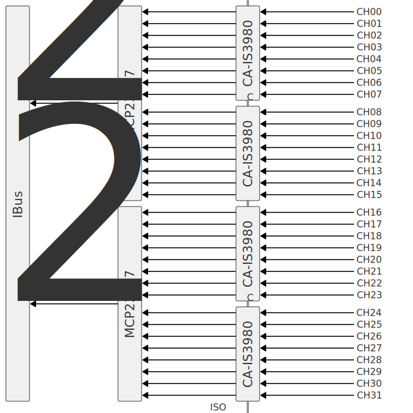

Модуль для подключения 32 дискретных входов постоянного напряжения. Входы гальванически изолированы от внутренней шины IBus.

Выбирая сопротивление резисторов, можно подключать сигналы с напряжением от 5 до 24 В. Напряжение выбирается для групп из 8 каналов.

Датчики можно подключать по схеме PNP или NPN. Конкретный тип выбирается с помощью перемычки на плате. Перемычка задаёт тип схемы для всех 32 каналов в модуле.

## Описание

## Опции
