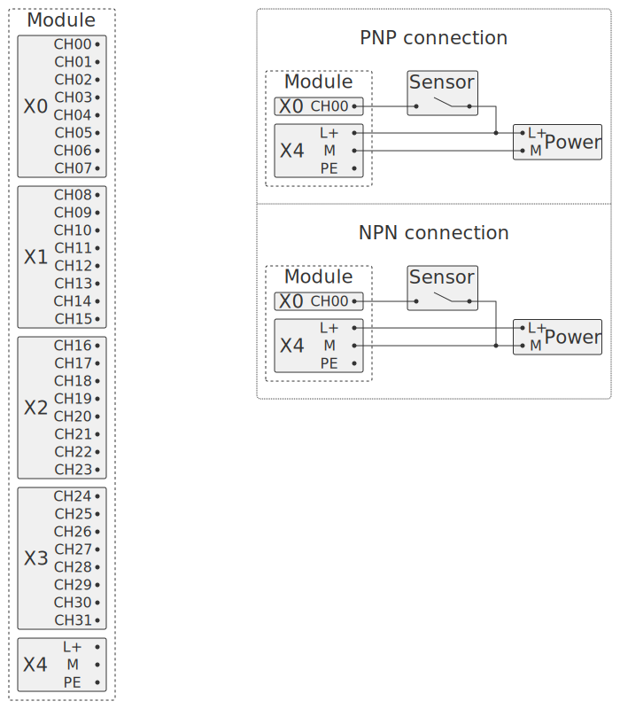
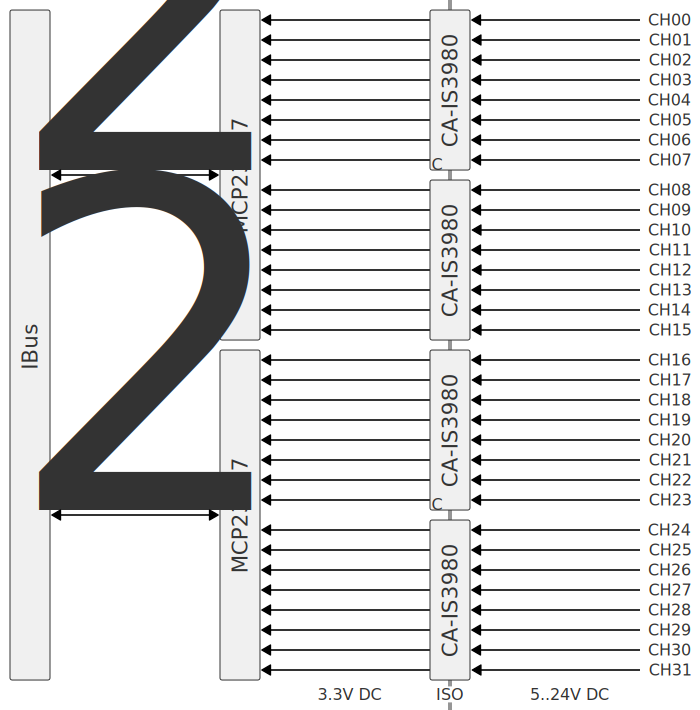

Модуль для подключения 32 дискретных входов постоянного напряжения. Входы гальванически изолированы от внутренней шины IBus.

Выбирая сопротивление резисторов, можно подключать сигналы с напряжением от 5 до 24 В. Напряжение выбирается для групп из 8 каналов.

## Схема внешних подключений

Датчики можно подключать по схеме PNP или NPN. Конкретный тип выбирается с помощью перемычки на плате. Перемычка задаёт тип схемы для всех 32 каналов в модуле.

## Опции

## Описание

Дискретные входы подключаются к 8-канальному изолятору сигналов CA-IS3980[^1]. Изолятор CA-IS3980 обеспечивает гальваническую изоляцию до 2.5кВ и до ±300кВ/мкс кратковременных помех.

Выходы CA-IS3980 подключаются к 16-канальному расширителю GPIO MCP23017[^2] с интерфейсом I²C. Адрес каждого MCP23017 задаётся перемычками.

Контроллер подключается через внутреннюю шину и опрашивает состояние входов по протоколу I²C.

## Расчёт номиналов резисторов

### Вывод формулы

В документации на чип CA-IS3980 не приведены формулы для расчёта номиналов резисторов. Выведем формулу для подбора номиналов резисторов на основе следующей схемы:

Обозначения на схеме:

- $U_{TH}$, $I_{TH}$ - значения напряжения и тока, при которых цифровой изолятор переходит из состояния «0» в состояние «1». Сокращение от «threshold».
- $U_F$ - желаемое входное напряжение для перехода из «0» в «1». Сокращение от «field».
- $R_1$, $R_2$ - сопротивления, которые необходимо подобрать.

По электрической схеме запишем систему уравнений:

- $ I_2 = I_1 + I_{TH} $
- $ U_F = I_2 ⋅ R_2 + I_1 ⋅ R_1 $
- $ U_{TH} = I_1 ⋅ R_1 $

Выведем формулу:

$ U_F = (I_1 + I_{TH}) ⋅ R_2 + I_1 ⋅ R_1 $

$ U_F = I_1 ⋅ (R_1 + R_2) + I_{TH} ⋅ R_2 $

$ U_F = \frac{U_{TH}}{R_1} ⋅ (R_1 + R_2) + I_{TH} ⋅ R_2 $

Финальная формула:

$ U_F = U_{TH} ⋅ (1 + \frac{R_2}{R_1}) + I_{TH} ⋅ R_2 $

В формуле две неизвестные величины: $R_1$ и $R_2$.

### Проверочный расчёт

Возьмём рекомендуемые значения для входного напряжения 24В, тип входов 3 (по IEC 61131-2):

- $U_F = 7.9 В$
- $U_{TH} = 1.38 В$ - по документации на чип CA-IS3980
- $I_{TH} = 0.6 мА$ - по документации на чип CA-IS3980
- $R_1 = 750 Ом$ - принятое значение сопротивления
- $R_2 = 2700 Ом$ - принятое значение сопротивления

$ 7.9 = 1.38 ⋅ (1 + \frac{2700}{750}) + 0.6 ⋅ 10^{-3} ⋅ 2700 $

$ 7.9 = 7.968 $

Значения почти равны. Рассчитаем значения токов:

- $I_1 = \frac{1.38}{750} = 1.84 ⋅ 10^{-3} А$
- $I_2 = 1.84 ⋅ 10^{-3} + 0.6 ⋅ 10^{-3} = 2.44 ⋅ 10^{-3} А$

### Принцип подбора номиналов резисторов

### Выбранные номиналы резисторов для разных уровней напряжения

[^1]: CA-IS3980 - https://e.chipanalog.com/products/interface/isolated/iso5/114.
[^2]: MCP23017 - https://www.microchip.com/en-us/product/mcp23017.
