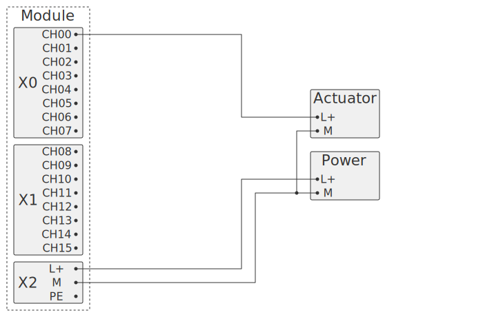

Модуль для управления 16 дискретными транзисторными выходами. Выходное напряжение до 50 В, до 200 мА на канал.

## Схема внешних подключений

Напряжение на выходах CH00 - CH15 соответствует напряжению источника питания, подключенного к коннектору X2.

## Опции

## Описание

Модуль управляется по протоколу I²C из шины IBus. Для обеспечения гальванической изоляции используется I²C-изолятор CA-IS3021[^1].

GPIO расширитель MCP23017[^2] получает команды по шине I²C и управляет выходами.

Сигналы с GPIO расширителя поступают на транзисторную сборку TBD62783[^3].

[^1]: CA-IS3021 - https://e.chipanalog.com/products/interface/isolated/i2c/1298
[^2]: MCP23017 - https://www.microchip.com/en-us/product/mcp23017.
[^3]: TBD62783 - https://toshiba.semicon-storage.com/eu/semiconductor/product/linear-ics/transistor-arrays/detail.TBD62783AFG.html
