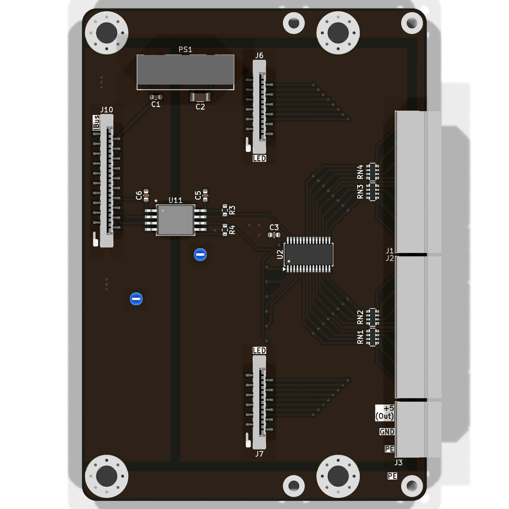
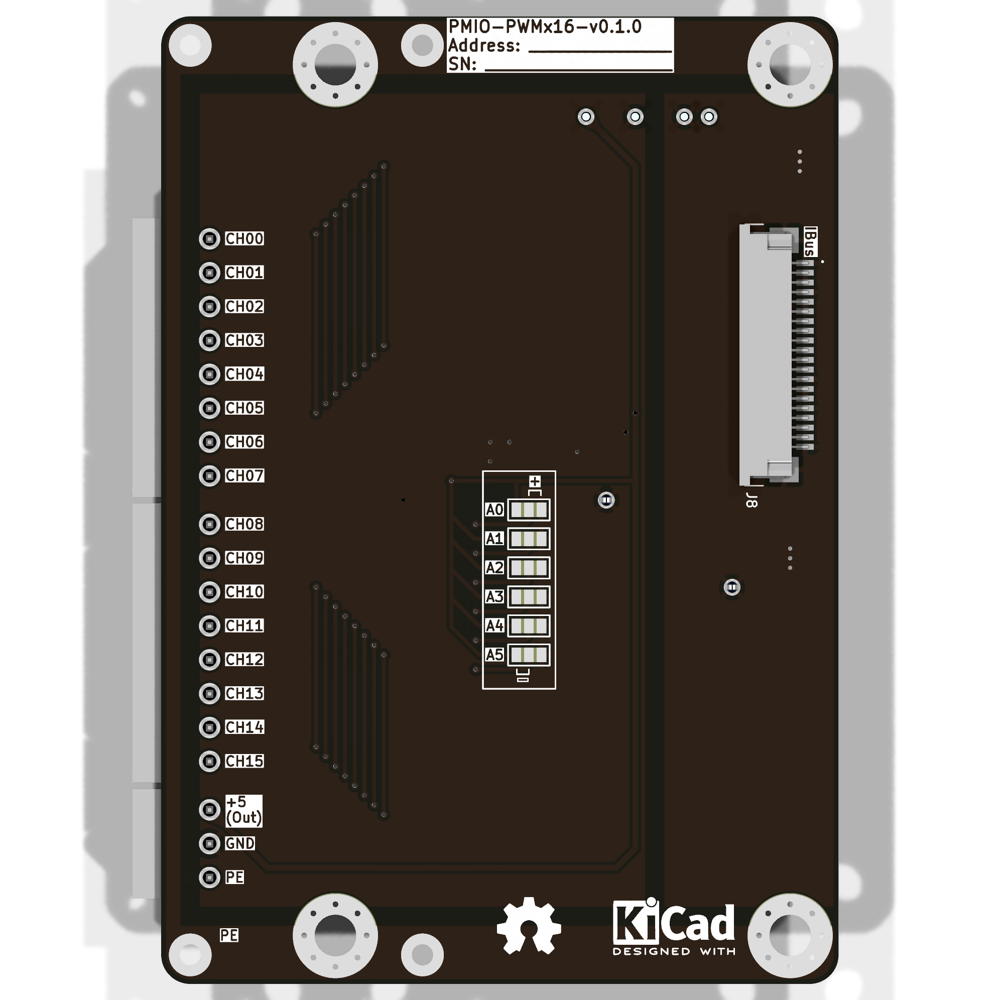

import Options  from '../../../../components/Options.astro';

{/* import ExtConn from "./PMIO-AITx8/ext_conn.svg";*/}
import Schematic from "./PMIO-PWMx16/schematic.svg";
import { options_config } from './PMIO-PWMx16/options.ts';

Модуль для управления 16 ШИМ выходами.

Работает на основе чипа **PCA9685** [^1].

## Опции

<Options options_config = { options_config } />

## Внешний вид

## Описание

<Schematic />

[^1]: **PCA9685** - https://www.nxp.com/products/power-drivers/lighting-driver-and-controller-ics/led-drivers/16-channel-12-bit-pwm-fm-plus-ic-bus-led-driver:PCA9685
