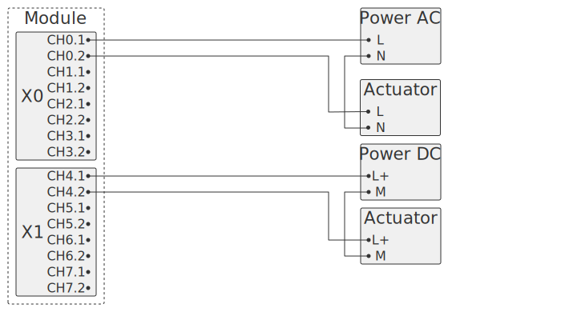
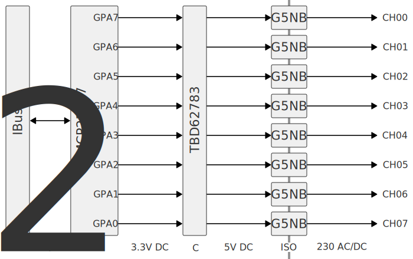

Модуль для управления 8 дискретными релейными выходами. Выход - нормально открытый контакт, к которому можно подключить нагрузку до 230В/3А на канал.

## Схема внешних подключений

- Power AC - источник переменного напряжения
- Power DC - источник постоянного напряжения
- Actuator - исполнительный механизм (реле, клапан и т.д.)

Все каналы независимы друг от друга, можно подключать напряжение от разных источников.

## Опции

## Описание

GPIO расширитель MCP23017[^1] получает команды по шине I²C и управляет выходами.

Сигналы с GPIO расширителя поступают на транзисторную сборку TBD62783[^2].

После транзисторов сигналы управления поступают на реле G5NB-1A-E-DC5[^3].

[^1]: MCP23017 - https://www.microchip.com/en-us/product/mcp23017.
[^2]: TBD62783 - https://toshiba.semicon-storage.com/eu/semiconductor/product/linear-ics/transistor-arrays/detail.TBD62783AFG.html
[^3]: G5NB-1A-E-DC5 - https://components.omron.com/us-en/products/relays/G5NB
