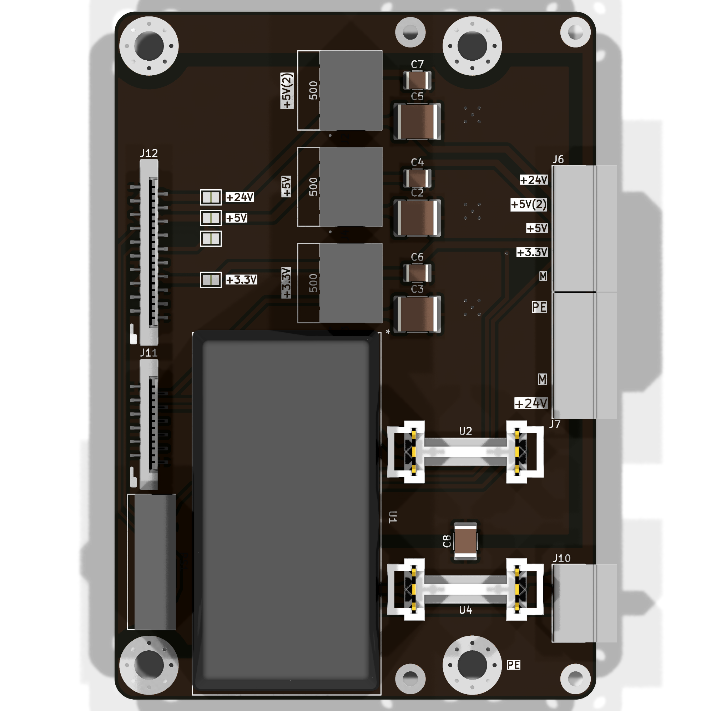
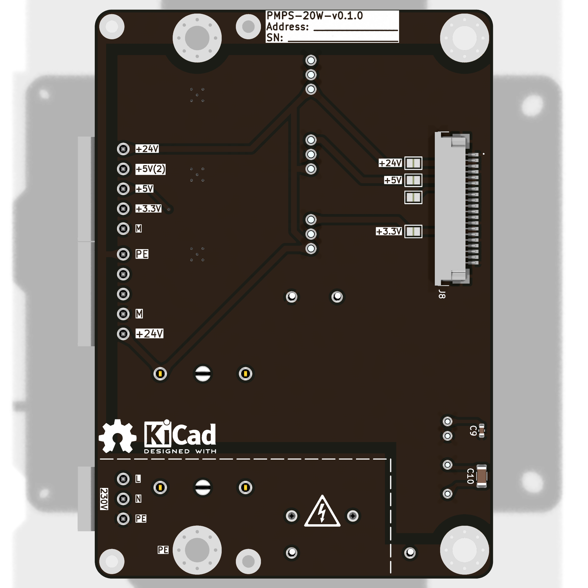

    { frontmatter.description }

Преобразует входное напряжение (AC 230В или DC 24В) в напряжения для питания потребителей, подключённых к шине IBus (DC 24В, DC 5В, DC 3,3В).

## Схема внешних подключений

## Конфигурация

## Внешний вид

## Описание

import Schematic from "./PMPS-20W/schematic.svg";

<Schematic />
